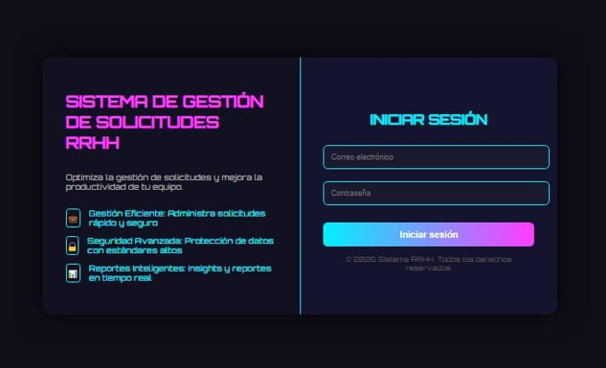
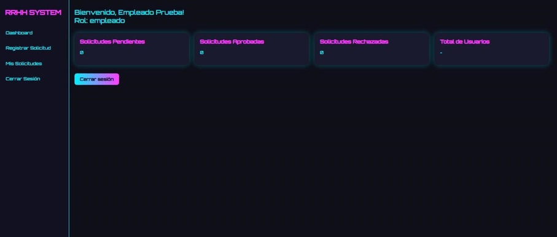

# Sistema Web de Registro y Seguimiento de Solicitudes Internas de RR.HH.

## Descripción del proyecto

Sistema web desarrollado para mejorar la gestión de solicitudes internas del área de Recursos Humanos, permitiendo registrar, administrar y realizar seguimiento a los requerimientos generados por los colaboradores.

La plataforma permite centralizar la información de solicitudes, controlar sus estados y facilitar la comunicación entre los usuarios y el área encargada.

---

## Tecnologías utilizadas

- PHP
- MySQL
- HTML5
- CSS3
- JavaScript
- Bootstrap
- XAMPP

---

# Capturas del sistema

## Inicio de sesión

---

## Registro de solicitud

---

## Verificación de registro

---

## Registro completo

---

## Tipo de solicitud

---

## Tablero de control

---

## Estado de solicitudes

---

## Solicitud aprobada o rechazada

---

# Funcionalidades principales

## Usuario colaborador

- Inicio de sesión.
- Registro de solicitudes internas.
- Consulta del estado de solicitudes.
- Seguimiento de requerimientos enviados.

## Usuario RR.HH.

- Visualización de solicitudes.
- Revisión de información registrada.
- Aprobación o rechazo de solicitudes.
- Actualización de estados.

## Administrador

- Gestión de usuarios.
- Control de accesos.
- Administración del sistema.

---

# Autor

**Sebastián Miranda**

Ingeniería de Sistemas

Proyecto académico
